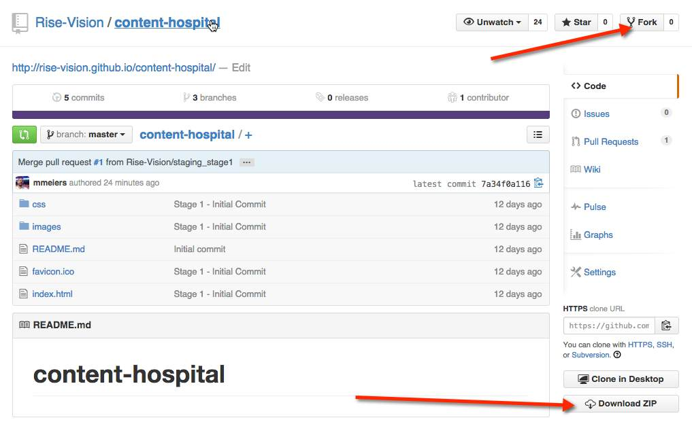
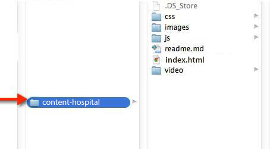
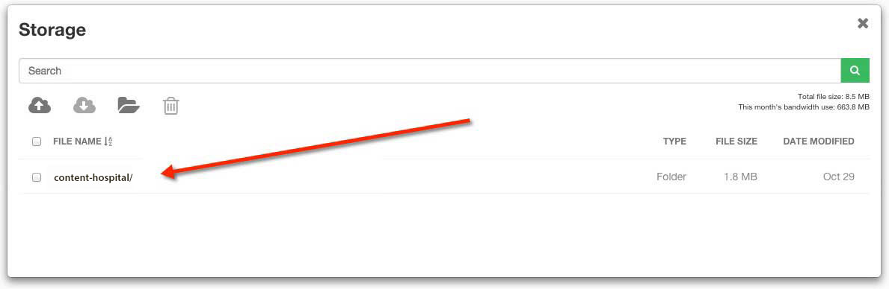

# Hospital

## Introduction

The Hospital Template was created to showcase current news & events that would be typical in a hospital environment. A preview of the template can be seen here: http://rise-vision.github.io/content-hospital/index.html

##Steps to run the Hospital Template:##

1. Fork or download the entire content-hospital repository.  


2. Modify the files within the content-hospital folder directory to fit your needs (see below on how to modify specific elements).  


3. Host the entire “content-hospital” folder directory in rise vision storage or your web hosting service.  


4. Copy the link to the index.html file where you have it hosted and insert the url into a schedule. (you can also add this link to the url gadget within a presentation)  


##Directions to Modify the Hospital Template:##

####Changing the Animated Background Image
Open index.html, locate the following code and modify the src url of the img tag to the path of your new background:

```
<div class="viewport">
    <div class="content-wrapper">
      <div class="content">
        
      </div>
    </div>
  </div>
```

Part of the background image is blurred and it can be modified within css/style-main.css file. Look for the classes ```.blur-box``` and ```.content-blurred```. The fluid aspect of this blurred effect is done with jquery. It can be customized within the js/blur.js and js/jquery.js files.

####Changing The Text Content
The text content is displayed through the use of the google-sheets web component. The example spreadsheet is located at https://docs.google.com/a/risedisplay.com/spreadsheets/d/1Wj-PV0YIi4I0qZs-HW-WDTVUrz6RP_GiVshndQkRD-Y/edit#gid=0

You can use your own public spreadsheet by locating the following code in the index.html file:

```<google-sheets id="sheet" 
               key="1Wj-PV0YIi4I0qZs-HW-WDTVUrz6RP_GiVshndQkRD-Y"
               gid="0"
               rows="{{rows}}"
               published>
</google-sheets>```

The key for your spreadsheet can be found when viewing the document online, as can be seen in the example above. 

In order to view a private spreadsheet, you will need to obtain an ID from https://console.developers.google.com. This is optional if accessing a public spreadsheet, and is currently set to 'sheet' in the above example.

You can then edit the text within the cells of the spreadsheet and the changes will appear in the display.

####Changing the Doctor Images
Open index.html, locate the following code and modify the src url of the img tags to the path of your graphics. :

```
<div id="doctor-container1">
	
</div>
	
<div id="doctor-container2">
	
</div>
```

The animation attributes assigned to the images are controlled within css/style-main.css. Look for the IDs ```#doctor-container1 img``` & ```#doctor-container2 img```. The actual keyframes for the ```bounceInRightImage``` animation can be modified within css/animate.css.

To add more than 2 images you will need to duplicate the container and img tags within index.html and adapt all the animation delays within the css.
example: ```-webkit-animation: bounceInRightImage 20s .8s ease infinite;```.
(.8s is the dealy in this example).

## Built With
actual tools used
- HTML
- CSS
- Javascript

Hospital Template works in conjunction with [Rise Vision](http://www.risevision.com), the [digital signage management application](http://rva.risevision.com/) that runs on [Google Cloud](https://cloud.google.com).

At this time Chrome is the only browser that this project and Rise Vision supports.

## Submitting Issues
If you encounter problems or find defects we really want to hear about them. If you could take the time to add them as issues to this Repository it would be most appreciated. Please Identify the specific template that has the issue and follow the following format where applicable:

**Reproduction Steps**

1. did this
2. then that
3. followed by this (screenshots / video captures always help)

**Expected Results**

What you expected to happen.

**Actual Results**

What actually happened. (screenshots / video captures always help)

## Contributing
All contributions are greatly appreciated and welcome! If you would first like to sound out your contribution ideas please post your thoughts to our [community](http://community.risevision.com), otherwise submit a pull request and we will do our best to incorporate it.

### Suggested Contributions
- Alternative ways to animate background
- Alternative ways to animate messages
- i18n Language Support

## Resources
If you have any questions or problems please don't hesitate to join our lively and responsive community at http://community.risevision.com.

If you are looking for user documentation on Rise Vision please see http://www.risevision.com/help/users/

If you would like more information on developing applications for Rise Vision please visit http://www.risevision.com/help/developers/.

 If you have any questions or problems please don't hesitate to join our lively and responsive community at http://community.risevision.com.
 
**Additional Content Templates can be found here: https://github.com/Rise-Vision/content-templates**

**Facilitator**

[Mathew Meiers](https://github.com/mmeiers "Mathew Meiers")